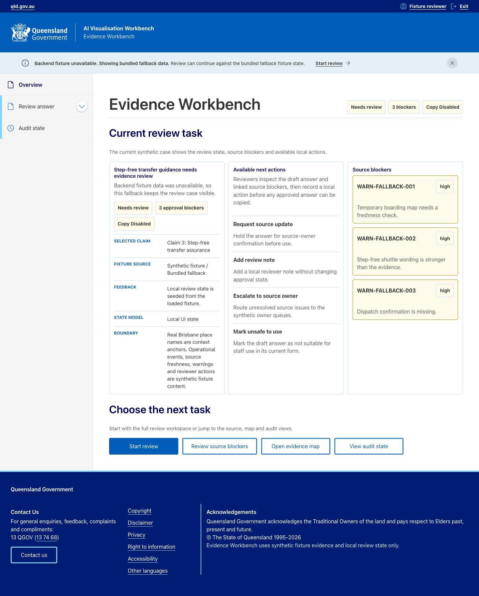
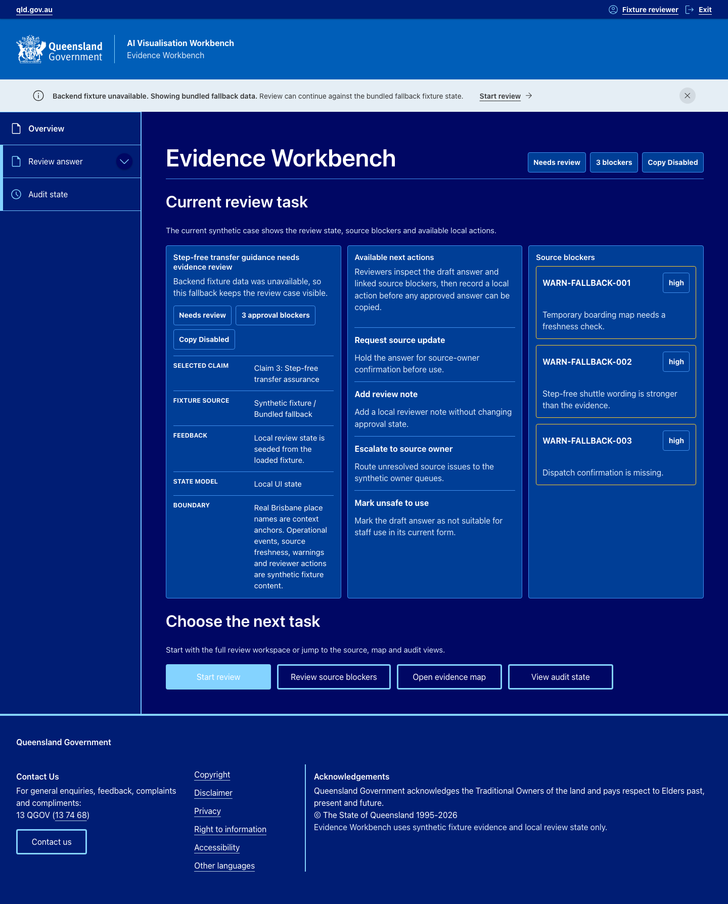
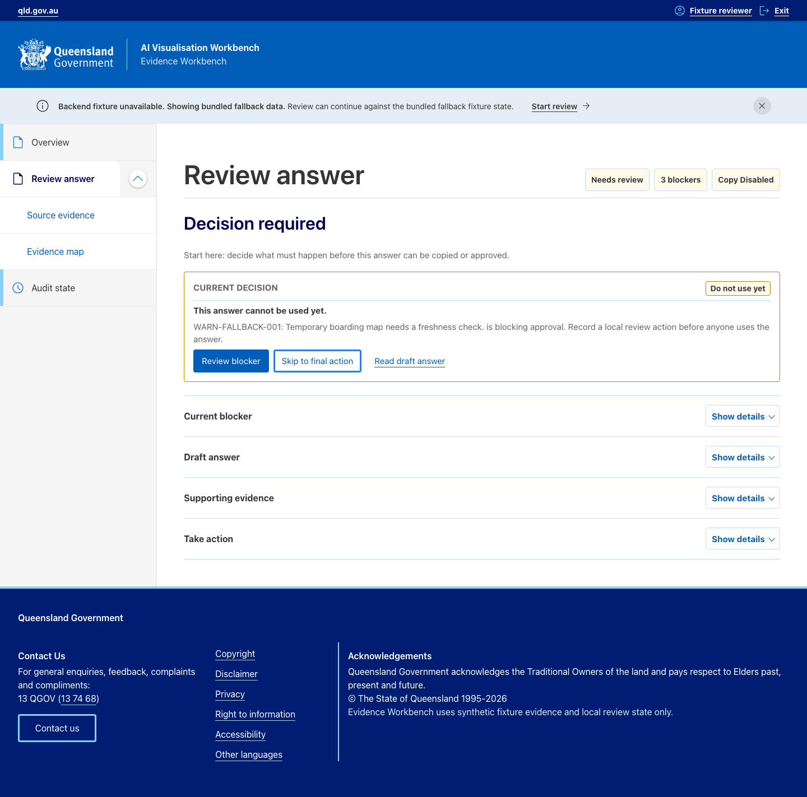
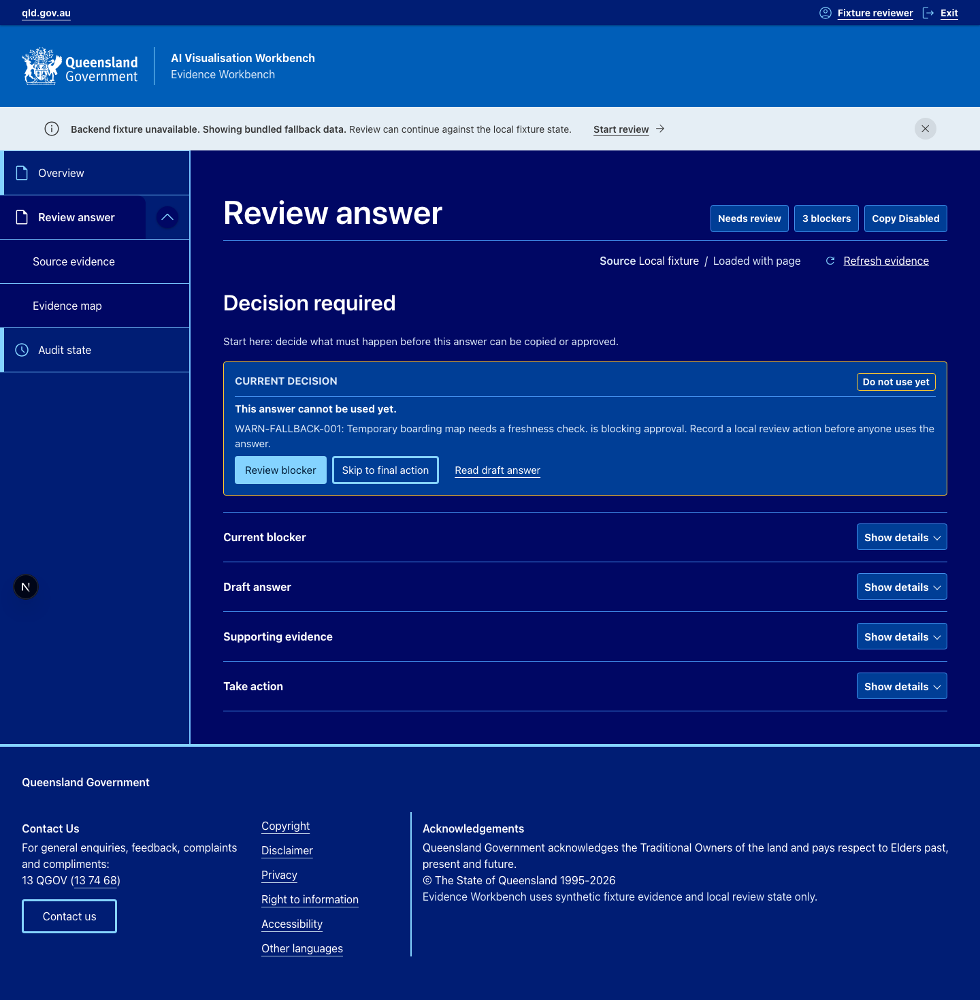
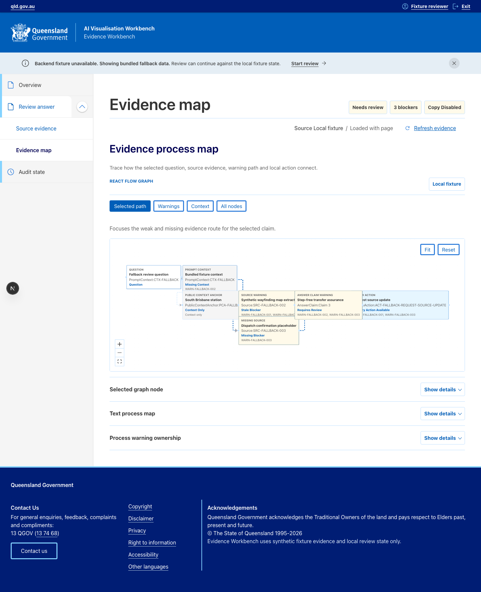
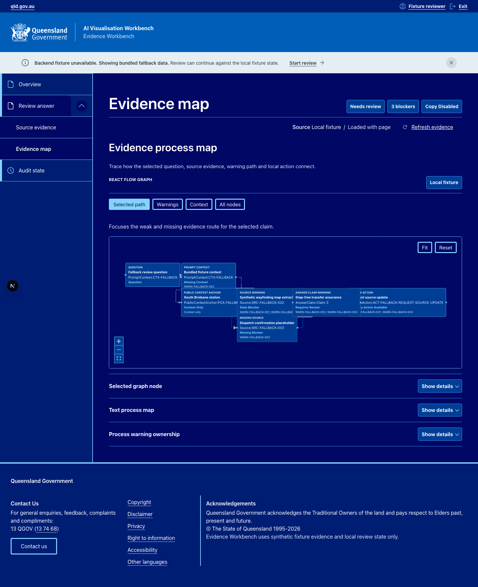

# Reviewer Pack

This is the public reviewer handover for the AI Visualisation Workbench
prototype. It is designed for a quick local review of the Evidence Workbench,
the synthetic evidence story and the checks that keep the public claims honest.

## Live Review

[Open the temporary AI Visualisation Workbench review demo](https://aivis-evidence-workbench-review-qbd9o.ondigitalocean.app/)

The public workbench uses a private deterministic fixture backend and synthetic
review content. The temporary link is review infrastructure, not an official
TMR environment or a production hosting claim.

## What This Demonstrates

- A reviewer-facing workbench for inspecting one AI-generated service-guidance
  answer before it is used.
- Source-backed markdown with citations, source warnings and disabled action
  reasons.
- A React Flow evidence/process map with a text fallback.
- Local review actions that show the current decision state and reset path.
- Public guard scripts that check claim boundaries, local links and reviewer
  evidence files.

## Five-Minute Review

From the repository root:

```text
pnpm install
pnpm --filter @aivis/workbench dev
```

Open:

```text
http://127.0.0.1:3200/evidence-workbench
```

For quick evidence checks:

```text
pnpm test:reviewer-evidence
pnpm guard:public-docs
pnpm guard:claim-boundaries
pnpm test:visual
```

`pnpm test:visual` is a no-screenshot DOM/layout check. The screenshots below
are checked-in reviewer examples.

## Route Review Path

1. `/evidence-workbench`: confirm the current case, warning posture and review
   task.
2. `/evidence-workbench/review`: inspect the draft answer, citations and
   selected source issue.
3. `/evidence-workbench/sources`: review source blockers, warning states and
   synthetic source records.
4. `/evidence-workbench/process`: inspect the evidence/process map and text
   fallback.
5. `/evidence-workbench/audit`: record or reset the local review state.

## Screenshot Gallery

These images are examples for reviewer orientation. They are not visual
baselines and are not regenerated by `pnpm test:visual`. The current captures
show the compact evidence data-state row below the task header, including the
object-labelled refresh action.

| View | Light | Dark theme-token preview |
| --- | --- | --- |
| Overview |  |  |
| Review answer |  |  |
| Evidence map |  |  |

## Evidence Checks

- `pnpm test:reviewer-evidence`: checks required public files, reviewer
  command references, screenshot files, Markdown links and unsupported-claim
  guardrails.
- `pnpm guard:public-docs`: checks public docs for private planning markers.
- `pnpm guard:claim-boundaries`: checks public docs and implementation text for
  unsupported production or official-system claims.
- `pnpm test:visual`: runs no-screenshot route, layout and theme-token checks
  across the current Evidence Workbench routes.

## Where To Go Deeper

- [Architecture](architecture.md), [frontend architecture](frontend-architecture.md)
  and [backend architecture](backend-architecture.md) explain the implemented
  layer boundaries.
- [Design-system adapter](design-system-adapter.md),
  [API and security evidence](api-and-security-evidence.md) and
  [accessibility and UI evidence](accessibility-and-ui-evidence.md) explain
  review-grade evidence and caveats.
- [Testing and guardrails](testing-and-guardrails.md) and
  [engineering decisions](engineering-decisions.md) connect public claims to
  local checks and principal engineering decisions.

## Caveats

- The scenario uses synthetic fixture evidence with public place names as
  context anchors only.
- Review actions use local review state only; they are not persisted as
  multi-user or production workflow state.
- Screenshots are reviewer examples, not visual baselines.
- Dark screenshots are theme-token preview capture context, not proof of a user-facing theme switcher.
- This repository does not claim real TMR data, an official TMR system, QChat integration, live AWS deployment, production RAG, production GraphRAG, Bedrock, Neo4j, Terraform, SSO, source-system writeback or production platform operation.
